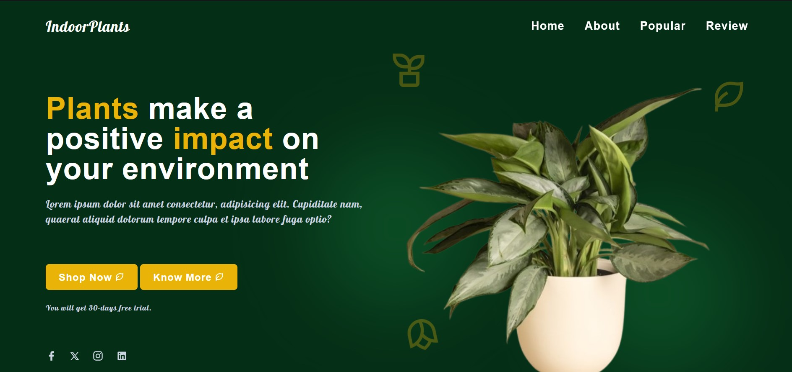
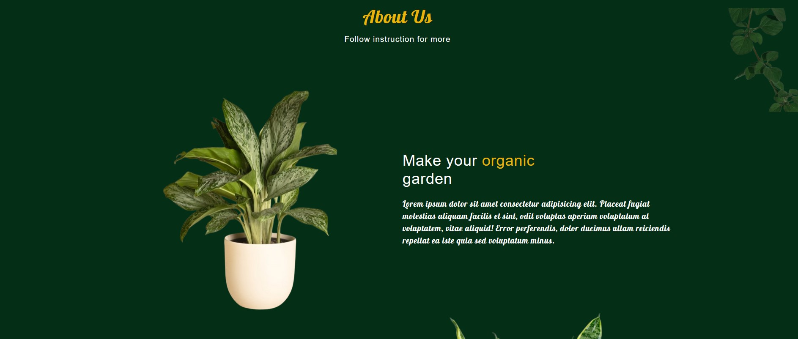
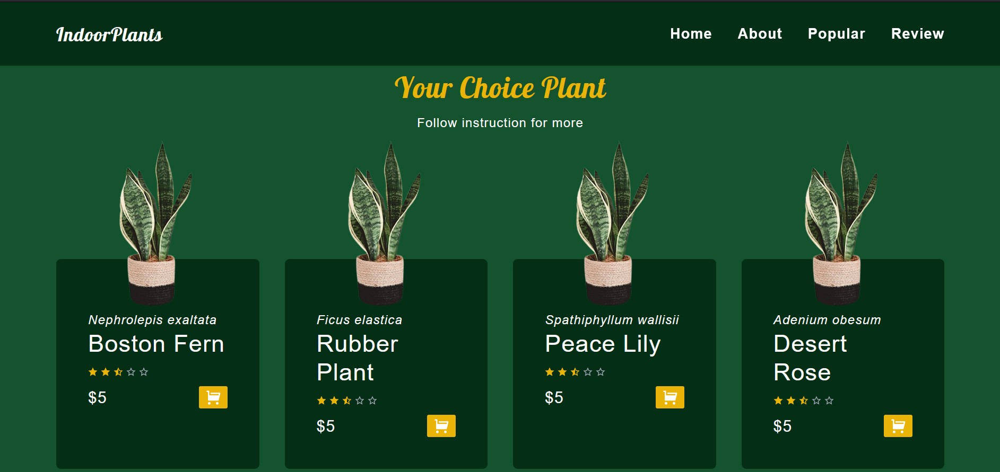
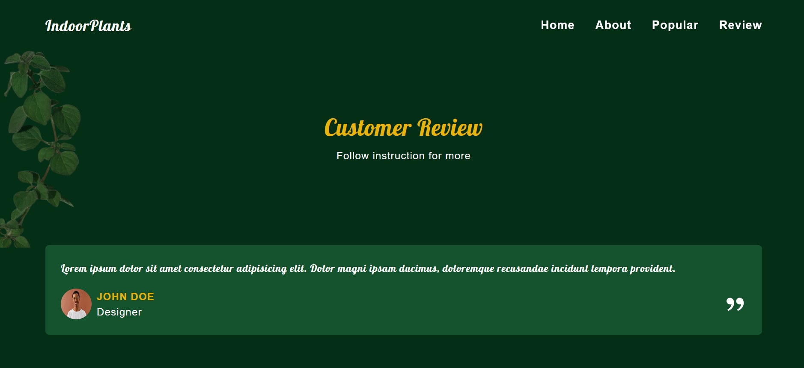
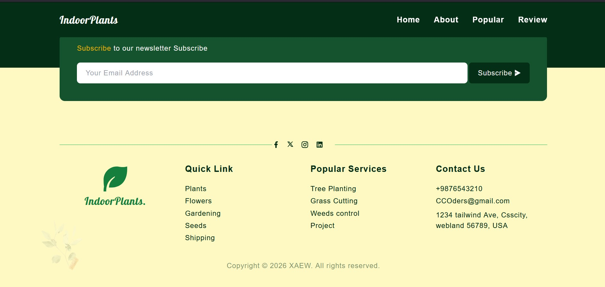

<h1>Site Name: SnackingBits</h1>

<h2>
SnackingBits is an e-commerce website where users can browse and purchase a variety of premium snack products.
</h2>

<h2>
This application is deployed on the Vercel platform.
</h2>

<h1>Tech Stack Used</h1>

<h2>Frontend</h2>
<h3>React</h3>
<h3>HTML</h3>
<h3>CSS</h3>
<h3>JavaScript</h3>
<h3>Tailwind CSS</h3>

<h1>Landing Page</h1>

<h3>
The navigation bar contains <b style="color:lightgreen">About</b>, <b style="color:lightgreen">Popular</b>, and <b style="color:lightgreen">Review</b> sections on the right side.
</h3>

<h3>
When you scroll down or click on the <b style="color:lightgreen">About</b> section in the navbar, the following section is displayed.
</h3>

<h3>
Scrolling further or clicking on the <b style="color:lightgreen">Popular</b> section in the navbar displays the popular products section.
</h3>

<h3>
Scrolling further or clicking on the <b style="color:lightgreen">Review</b> section in the navbar displays the customer reviews section.
</h3>

<h3>
At the bottom of the page, you can find the footer section.
</h3>

<h2>
This website was designed and developed from scratch within one day.
</h2>
